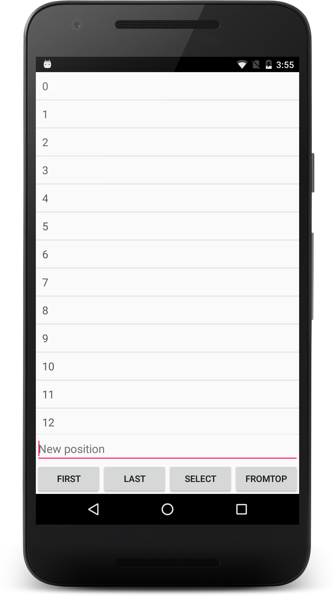

EasyAdapterView
----
####支持的特性 

* 水平、垂直，无限滚动的 ListView
* 水平、垂直，无限滚动的 WheelView
* 真正意义上无限滚动的 BannerView

如果实现无限滚动？
<pre><code>\<com.lovely3x.eavlibrary.EasyAdapterView
        android:id="@+id/eav_activity_list_view_list"
        android:layout_width="match_parent"
        android:layout_height="0dp"
        android:layout_weight="1"
        app:dividerHeight="1dp"
        app:mode="endLessListView"
        app:orientation="vertical" />
</code></pre>

##### 只需要设置 `mode` 为 `endlessXXX` 就是无限滚动模式
##### 只需要设置 `orientation` 为 `horizontal` 则为水平模式，`vertical `则为垂直模式

##大家先来看看效果吧！

## `WheelView` 截图
####三级城市联动效果
<video width='400px' id="video" controls="" preload="none" poster="./screenshot/wheelView_screenshot_1.png">
      <source id="mp4" src=./screenshot/WheelView.mp4 type="video/mp4">
</video>

## `Banner` 截图
<video width='400px' id="video" controls="" preload="none" poster="./screenshot/banner_screenshot.png">
      <source id="mp4" src=./screenshot/banner.mp4 type="video/mp4">
</video>

## 垂直 `ListView` 截图
</img>

## 水平 `ListView` 截图
</img>